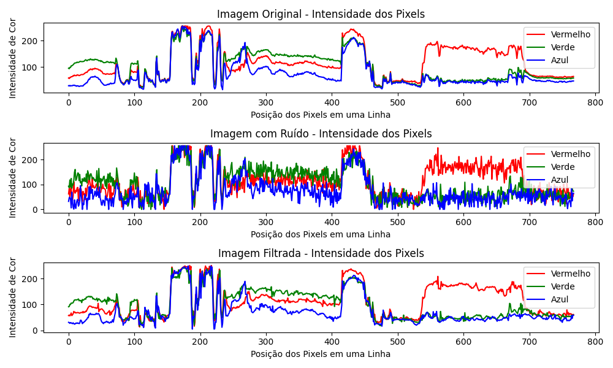

# Remoção de Ruído Branco Gaussiano com Filtro de Wiener

Este repositório contém um tutorial prático e teórico sobre a aplicação de ruído branco gaussiano a imagens e sua posterior remoção utilizando o Filtro de Wiener.

---
## Ruído Branco Gaussiano
O ruído branco gaussiano aditivo (AWGN) é um modelo probabilístico amplamente utilizado em sistemas de comunicação e processamento de imagens digitais. Ele é chamado de "branco" porque apresenta distribuição espectral plana, ou seja, sua energia é distribuída igualmente entre todas as frequências (GONZALEZ; WOODS, 2010). É dito "gaussiano" porque os valores de intensidade do ruído seguem uma distribuição normal (curva de Gauss), caracterizada por uma média ($μ$) e e uma variância ($σ^2$).

### Ruído em Imagens RGB
Na prática, especialmente em imagens coloridas no formato RGB, o ruído branco gaussiano pode ser aplicado individualmente a cada canal de cor (vermelho, verde e azul). Em vez de interferir apenas na intensidade luminosa (como em imagens em tons de cinza), o ruído afeta diretamente os valores dos pixels em cada um dos três canais, gerando artefatos visuais coloridos. Isso simula situações reais em que sensores de câmeras digitais captam interferência elétrica ou térmica de maneira não uniforme, resultando em ruído perceptível em cores diferentes (LIM, 1990).

### O ruído aditivo é comum em:

+ Sistemas de aquisição de imagem, como scanners e câmeras digitais;
+ Transmissão de imagens por canais sujeitos a interferências (ex: rede sem fio);
+ Equipamentos sujeitos a ruído térmico, como sensores CCD e CMOS (PRATT, 2007).

Do ponto de vista matemático, se $I(x,y)$ representa a imagem original, $n(x,y)$ é o ruído gaussinao com distribuição $N(0,\sigma^2)$ e $n(x,y)$ representa um valor gerado aleatoriamente pelo ruído, a imagem ruidosa é dada por:

$I_r(x,y) = I(x,y) + n(x,y)$

No caso de imagens RGB, a fórmula se aplica separadamente aos canais R, G e B.

<table>
  <tr>
    <td align="center">
      <br>
      <sub>Imagem original</sub>
    </td>
    <td align="center">
      <br>
      <sub>Imagem com ruído (desvio padrão 30 para cada canal de cor)</sub>
    </td>
  </tr>
</table>

### Aplicação

Para gerar valores com distribuição normal (gaussiana), utilizamos o método de Box-Muller, que converte dois números aleatórios uniformemente distribuídos em um número com distribuição normal padrão. Esse método é implementado na função a seguir:

```
// Gera número com distribuição normal padrão (Box-Muller)
float gerarRuidoGaussiano(float media, float desvio) {
    // Gera dois números aleatórios uniformes no intervalo (0, 1)
    float u1 = (rand() + 1.0f) / (RAND_MAX + 1.0f);
    float u2 = (rand() + 1.0f) / (RAND_MAX + 1.0f);

    // Aplica a Transformada de Box-Muller para obter um valor com distribuição normal padrão (média 0, desvio 1)
    float z = sqrtf(-2.0f * logf(u1)) * cosf(2.0f * M_PI * u2);

    // Escala para a distribuição desejada (com média e desvio fornecidos)
    return z * desvio + media;
}
```

A função acima é utilizada para simular ruído gaussiano branco em imagens RGB, aplicando perturbações independentes a cada canal de cor (vermelho, verde e azul). A imagem ruidosa é processada diretamente na superfície SDL fornecida:

```
// Aplica ruído gaussiano branco à imagem
void applyGaussianNoise(SDL_Surface *surface, float media, float desvio) {
    int largura = surface->w;
    int altura = surface->h;

    // Obtém os detalhes do formato de pixel para mapear cores corretamente
    const SDL_PixelFormatDetails *format = SDL_GetPixelFormatDetails(surface->format);

    // Percorre cada pixel da imagem
    for (int y = 0; y < altura; y++) {
        for (int x = 0; x < largura; x++) {

            // Acessa o pixel na posição (x, y)
            Uint32 pixel = *((Uint32 *)surface->pixels + y * largura + x);

            // Extrai os valores RGB do pixel atual
            Uint8 r, g, b;
            SDL_GetRGB(pixel, format, NULL, &r, &g, &b);  // <- Corrigir: NULL deve ser &r!

            // Adiciona ruído gaussiano a cada canal de cor
            float novoR = r + gerarRuidoGaussiano(media, desvio);
            float novoG = g + gerarRuidoGaussiano(media, desvio);
            float novoB = b + gerarRuidoGaussiano(media, desvio);

            // Garante que os valores fiquem dentro do intervalo [0, 255]
            r = (Uint8)(novoR < 0 ? 0 : (novoR > 255 ? 255 : novoR));
            g = (Uint8)(novoG < 0 ? 0 : (novoG > 255 ? 255 : novoG));
            b = (Uint8)(novoB < 0 ? 0 : (novoB > 255 ? 255 : novoB));

            // Atualiza o pixel com os novos valores ruidosos
            *((Uint32 *)surface->pixels + y * largura + x) = SDL_MapRGB(format, NULL, r, g, b);
        }
    }
}
```

### Resultado da aplicação

<table>
  <tr>
    <td align="center">
      <br>
      <sub>Imagem original</sub>
    </td>
    <td align="center">
      <br>
      <sub>Imagem com ruído (desvio padrão 30 para cada canal de cor e media zero)</sub>
    </td>
  </tr>
</table>

---

## Filtro de Wiener

O filtro de Wiener é uma técnica clássica de restauração de imagens ruidosas, projetado para minimizar o erro quadrático médio (MSE) entre a imagem restaurada e a imagem original. Ele parte do princípio de que a imagem degradada pode ser modelada como a soma da imagem original com um ruído aditivo, como o ruido gaussiano de média zero.
O filtro de Wiener trabalha localmente, isto é, calcula estatísticas (média e variância) dentro de uma vizinhança em torno de cada pixel para estimar o valor mais provável do sinal original naquele ponto. O valor restaurado $Î(x,y)$ é obtido por meio da seguinte equação:

$Î(x,y) = μ+((σ^2σ_n^2)/σ^2)*(I_r(x,y)-μ)$

Onde:
+ μ é a média local da vizinhança;
+ $σ^2# é a variância local;
+ $σ_n^2 é a variância estimada do ruído (normalmente fornecida como parâmetro);
+ $I_r(x,y)$ é o valor do pixel observado com ruído.

Essa fórmula permite que o filtro atue de maneira adaptativa: quando a variância local é alta, indicando detalhes ou bordas, o filtro preserva melhor o contraste local; quando a variância é baixa, indicando áreas homogêneas, o filtro atua de forma mais agressiva para suavizar o ruído (GONZALEZ; WOODS, 2010).

A principal vantagem do filtro de Wiener sobre filtros lineares simples (como a média) é sua capacidade de equilibrar a redução de ruído com a preservação de detalhes, tornando-o ideal para casos em que o ruído é do tipo gaussiano branco, como ocorre comumente em sensores digitais (JAIN, 1989; LIM, 1990).

### Filtro em Imagens RGB

No caso de imagens RGB, como é o contexto deste trabalho, o filtro é aplicado separadamente em cada canal de cor (vermelho, verde e azul). Assim, a suavização respeita a estrutura de cor da imagem, reduzindo o ruído em cada componente de forma independente.

<table>
  <tr>
    <td align="center">
      <br>
      <sub>Imagem com ruído (desvio padrão 30 para cada canal de cor)</sub>
    </td>
    <td align="center">
      <br>
      <sub>Imagem filtrada</sub>
    </td>
  </tr>
</table>

### Aplicação

Após a adição do ruído gaussiano, aplica-se o filtro de Wiener, que atua como um método adaptativo para suavizar o ruído preservando os detalhes da imagem. Ele utiliza uma vizinhança ao redor de cada pixel (janela) para calcular estatísticas locais como média e variância, ajustando a intensidade de cada cor conforme a estimativa do ruído presente.

```

void applyWienerFilterRGB(SDL_Surface *surface, float noiseVariance) {
    int largura = surface->w;
    int altura = surface->h;
    // Cria uma cópia da superfície original para preservar os valores durante o processamento
    SDL_Surface *copySurface = SDL_ConvertSurface(surface, surface->format);
    if (!copySurface){
        SDL_Log("Erro ao criar superfície de cópia: %s\n", SDL_GetError());
        return;
    }
    int meioFiltro = AREA_FILTRO / 2;
    int totalPixels = AREA_FILTRO * AREA_FILTRO;
    const SDL_PixelFormatDetails *format = SDL_GetPixelFormatDetails(surface->format);

    for (int y = 0; y < altura; y++) {
        for (int x = 0; x < largura; x++) {
            float somaR = 0, somaG = 0, somaB = 0;
            float somaR2 = 0, somaG2 = 0, somaB2 = 0;
            // Calcula média e variância local usando uma janela centrada no pixel
            for (int dy = -meioFiltro; dy <= meioFiltro; dy++) {
                for (int dx = -meioFiltro; dx <= meioFiltro; dx++) {
                    int rx = x + dx;
                    int ry = y + dy;

                    // Reflexão de bordas (para evitar extrapolação da imagem)
                    if (rx < 0) rx = -rx;
                    if (ry < 0) ry = -ry;
                    if (rx >= largura) rx = 2 * largura - rx - 2;
                    if (ry >= altura) ry = 2 * altura - ry - 2;

                    Uint32 pixel = *((Uint32 *)surface->pixels + ry * largura + rx);
                    Uint8 r, g, b;
                    SDL_GetRGB(pixel, format, &r, &g, &b);

                    somaR += r;
                    somaG += g;
                    somaB += b;
                    somaR2 += r * r;
                    somaG2 += g * g;
                    somaB2 += b * b;
                }
            }

            float mediaR = somaR / totalPixels;
            float mediaG = somaG / totalPixels;
            float mediaB = somaB / totalPixels;
            float varR = (somaR2 / totalPixels) - (mediaR * mediaR);
            float varG = (somaG2 / totalPixels) - (mediaG * mediaG);
            float varB = (somaB2 / totalPixels) - (mediaB * mediaB);

            // Obtém o valor original do pixel da imagem original (não filtrada)
            Uint32 pixelOrig = *((Uint32 *)copySurface->pixels + y * largura + x);
            Uint8 rOrig, gOrig, bOrig;
            SDL_GetRGB(pixelOrig, format, &rOrig, &gOrig, &bOrig);

            // Aplica a fórmula do filtro de Wiener para cada canal de cor
            float fatorR = (varR > noiseVariance) ? (varR - noiseVariance) / varR : 0;
            float fatorG = (varG > noiseVariance) ? (varG - noiseVariance) / varG : 0;
            float fatorB = (varB > noiseVariance) ? (varB - noiseVariance) / varB : 0;
            float rFinal = mediaR + fatorR * (rOrig - mediaR);
            float gFinal = mediaG + fatorG * (gOrig - mediaG);
            float bFinal = mediaB + fatorB * (bOrig - mediaB);

            // Limita os valores entre 0 e 255
            Uint8 r = (Uint8)(rFinal < 0 ? 0 : (rFinal > 255 ? 255 : rFinal));
            Uint8 g = (Uint8)(gFinal < 0 ? 0 : (gFinal > 255 ? 255 : gFinal));
            Uint8 b = (Uint8)(bFinal < 0 ? 0 : (bFinal > 255 ? 255 : bFinal));

            // Atualiza o pixel filtrado na cópia da imagem
            Uint32 pixelNovo = SDL_MapRGB(format, r, g, b);
            *((Uint32 *)copySurface->pixels + y * largura + x) = pixelNovo;
        }
    }

    // Substitui a imagem original pela imagem filtrada
    SDL_BlitSurface(copySurface, NULL, surface, NULL);
    SDL_DestroySurface(copySurface);
}
```

## Resultados 

<table>
  <tr>
    <td align="center">
      <br>
      <sub>Imagem com ruído (desvio padrão 30 para cada canal de cor e media zero)</sub>
    </td>
    <td align="center">
      <br>
      <sub>Imagem filtrada (area do filtro de 25 pixels)</sub>
    </td>
  </tr>
</table>


## Comparação das imagens geradas
<table>
  <tr>
    <td align="center">
      <br>
      <sub>Imagem original</sub>
    </td>
    <td align="center">
      <br>
      <sub>Imagem com ruído (desvio padrão 30 para cada canal de cor)</sub>
    </td>
    <td align="center">
      <br>
      <sub>Imagem filtrada (area do filtro de 25 pixels)</sub>
    </td>
  </tr>
</table>

<p align="center">
  <br>
  <sub>Histograma de cada canal de cor das imagens geradas pelo programa e da imagem original</sub>
</p>

<p align="center">
  <br>
  <sub>Grafico de uma linha das imagens geradas pelo programa e da imagem original</sub>
</p>

# Integrantes do grupo:  
* João Pedro de Souza Costa Ferreira - 10400720

* David Varão Lima Bentes Pessoa - 10402647

* Pedro Nomura Picchioni - 10401616

* Victor Vaglieri de Oliveira - 10400787

# Referências
GONZALEZ, R. C.; WOODS, R. E. Digital Image Processing. 3. ed. Upper Saddle River: Pearson Prentice Hall, 2010.

JAIN, A. K. Fundamentals of Digital Image Processing. Englewood Cliffs: Prentice Hall, 1989.

LIM, J. S. Two-Dimensional Signal and Image Processing. Englewood Cliffs: Prentice-Hall, 1990.

PRATT, W. K. Digital Image Processing: PIKS Scientific Inside. 4. ed. Hoboken: Wiley-Interscience, 2007.

